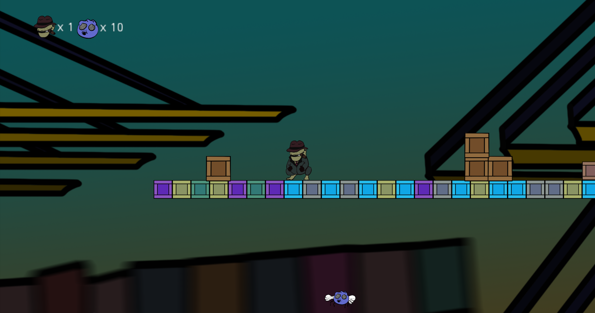

<div align="center">
  

  # Platform Godot

  **A 2D side-scrolling platformer built with Godot 3**

  [](https://godotengine.org/)
  [](https://docs.godotengine.org/en/stable/tutorials/scripting/gdscript/)
  [](https://docs.godotengine.org/en/stable/tutorials/export/exporting_for_web.html)
  []()
</div>

---

## Overview

Platform Godot is a 2D side-scrolling platformer developed with [Godot Engine 3](https://godotengine.org/) and GDScript as an individual academic project. The player explores a multi-scene world, collecting flies and fighting enemies across two levels — culminating in a boss encounter — with 3 lives and a goal-based win condition.

The project is exported as an **HTML5 web build**, meaning it can be played directly in a browser without any installation.

> [!NOTE]
> Full project design documentation is available in [`DOCUMENTACION.pdf`](DOCUMENTACION.pdf), included in the repository root.

## Gameplay

The player character starts on Level 1 and must collect **10 flies** scattered across multiple connected scenes. Collecting them all progresses the player toward the boss fight on Level 2, where victory triggers the win screen.

- **3 lives** — lose them all and you hit the Game Over screen, resetting progress
- **10 flies to collect** — collecting the first 6 triggers a scene transition within Level 1
- **Bite attack** — the player can attack enemies with a bite action
- **Boss fight** — clear Level 1 to face the Level 2 boss; defeat it to win

## Project Structure

```
Platform_Godot/
├── Levels/
│   ├── Level 1/
│   │   ├── scene1.tscn          # Starting scene (entry point)
│   │   ├── scene2.tscn
│   │   ├── scene3.tscn
│   │   └── scene4.tscn
│   ├── Level 2/
│   │   └── level 2.tscn         # Boss level
│   ├── gameover.tscn
│   └── win.tscn
├── Scripts/                     # GDScript files for game logic
├── Objects/                     # Scene nodes for interactive objects
├── Animations/                  # AnimationPlayer resources
├── Sprites/                     # Sprite textures
├── Background/                  # Background art assets
├── Export/                      # HTML5 web export output
├── Global.gd                    # Autoloaded singleton — manages global state
├── project.godot                # Godot project configuration
├── export_presets.cfg           # HTML5 export settings
├── tilemap.tres                 # TileMap resource
├── DOCUMENTACION.pdf            # Full project design document (6 pages)
└── captura.png                  # In-game screenshot
```

### Global Singleton (`Global.gd`)

The `Global` autoload node acts as the central game state manager. It tracks lives and fly count across scene changes and handles all scene transitions:

| Variable | Default | Description |
|---|---|---|
| `health` | `3` | Player lives |
| `moscas` | `10` | Flies remaining to collect |

Key functions: `restarMosca()` (collect a fly, trigger transitions), `restarVida()` (lose a life), `reset()` (restart to Game Over), `win()` (go to win screen).

## Controls

| Input | Action |
|---|---|
| `←` `→` Arrow keys | Move left / right |
| `Space` | Jump |
| `Space` (near enemy) | Bite attack |

> [!TIP]
> The jump and bite actions share the Space key — context determines the result. Timing your bite near enemies is key to clearing obstacles.

## Getting Started

### Prerequisites

- [Godot Engine 3.x](https://godotengine.org/download/archive/) (the project uses `config_version=4`, which corresponds to Godot 3)

> [!IMPORTANT]
> This project is **not compatible with Godot 4**. The GDScript syntax, scene format, and export presets are all Godot 3 — make sure to download a **Godot 3.x** release.

### Running in the Editor

1. **Clone the repository**

   ```bash
   git clone https://github.com/NicoRuedaA/Platform_Godot.git
   ```

2. **Open in Godot 3**

   - Launch Godot 3, click **Import**, and select the `Platform_Godot/` folder
   - Godot will detect `project.godot` automatically

3. **Press F5** (or the Play button) to run — the game starts from `Levels/Level 1/scene1.tscn`

### Playing the Web Build

A pre-built HTML5 export is included in the `Export/` folder. To play it locally, you need to serve it over HTTP (browsers block local file access for web exports):

```bash
cd Export
python3 -m http.server 8080
# Then open http://localhost:8080 in your browser
```

> [!NOTE]
> Opening the `.html` file directly from your file system (`file://`) will not work due to browser security restrictions on WebAssembly. Always use a local server.

### Exporting from the Editor

The project is pre-configured with an HTML5 export preset. To re-export:

1. In Godot 3, go to **Project → Export**
2. Select the **HTML5** preset
3. Click **Export Project** — output goes to `Export/Practica individual.html`

> [!TIP]
> To export HTML5 builds, you need the [Godot 3 HTML5 export templates](https://godotengine.org/download/archive/) installed. In the editor: **Editor → Manage Export Templates**.

## Tech Stack

| Category | Technology |
|---|---|
| Engine | [Godot 3.x](https://godotengine.org/) |
| Language | GDScript |
| Export target | HTML5 / WebAssembly |
| Resolution | 1920 × 1080, fullscreen |
| Level design | TileMap + individual scenes |
| State management | Autoloaded singleton (`Global.gd`) |

## Documentation

The `DOCUMENTACION.pdf` (6 pages) covers the full design of the project, including game concept, scene structure, mechanics breakdown, and implementation notes. It is also available page by page as images in the repository root.

---

<div align="center">
  Developed by <a href="https://github.com/NicoRuedaA">Nico Rueda</a>
</div>
